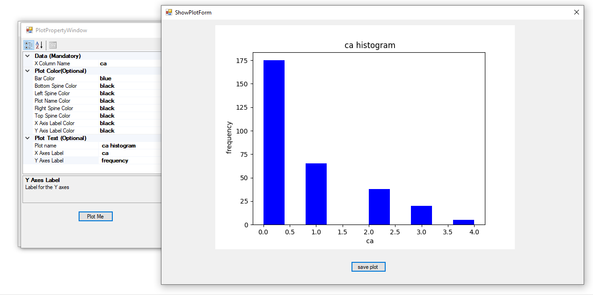

# CSV GRAPH
## Graph Maker from csv file

Csv Graph is a software created to create graph or plot from a csv file

- upload csv file by pressing the **open** button
- Select Plot Type
- Fill the requirements and press the plot button to create the graph

## Features

- Scatter Graph
- Histogram Graph

## Installation

Install [here](https://drive.google.com/drive/folders/1l6OqOB2IzKvXarkO6kq6cMJ-UCG33QRA?usp=sharing)
Unzip and run CsvPlotterAndGrapher.exe

## Development

Want to contribute? Great!

## License

MIT

