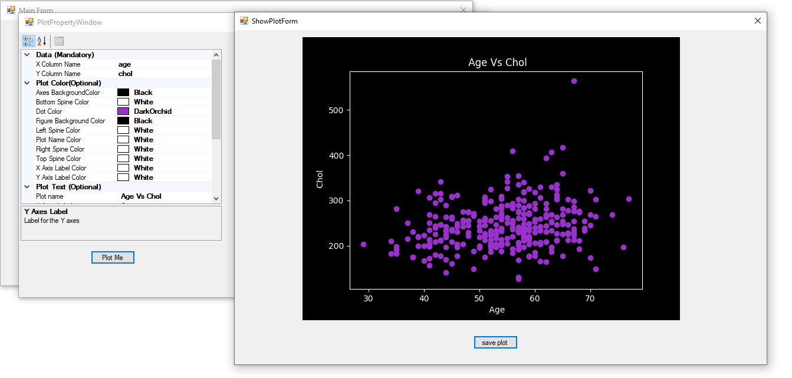

# CSV GRAPH
## Graph Maker from csv file



Csv Graph is a software created to create graph or plot from a csv file

- upload csv file by pressing the **open** button
- Select Plot Type
- Fill the requirements and press the plot button to create the graph

## Features

- Scatter Graph
- Histogram Graph


## Installation


Install [here](https://drive.google.com/drive/folders/1l6OqOB2IzKvXarkO6kq6cMJ-UCG33QRA?usp=sharing)
Unzip and run CsvPlotterAndGrapher.exe

## Contribution

The Gui is created using c# (winform project) and the plot is created using python and matplotlib 

## Contribution

Want to contribute? Great!


## Development Enviroment Setup
Use visual studio for  **WindowFormProject** (Developing the GUI)

Use pycharm for **PythonBackend**(Developing Backend and Api)

open command line , navigate to PythonBackend 's directory and use

```sh
 pip install -r requirements.txt
```
To install of of the packages for the python project


## License

MIT


